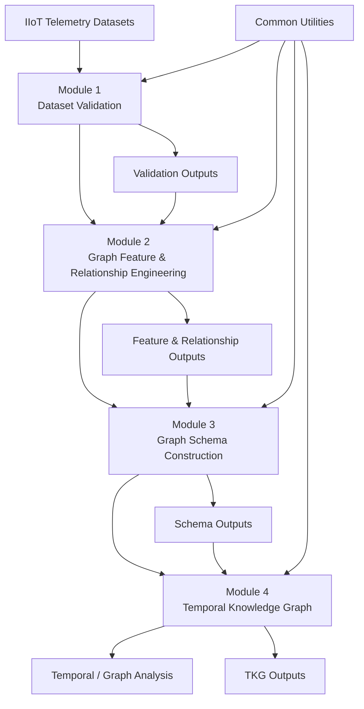

# Adaptive Graph Intelligence

### CORTEX — Context & Graph-Aware Multi-Agent Framework for Explainable Industrial IoT Threat Intelligence

[](#)
[](#)
[](#)
[](#)

---

## 1. Overview

**Adaptive Graph Intelligence** is the graph-oriented component of the **CORTEX** framework for transforming heterogeneous Industrial Internet of Things (IIoT) telemetry into structured, connected, and temporally ordered graph representations.

The implementation progressively transforms raw telemetry into:

```text
Heterogeneous IIoT Telemetry
            │
            ▼
┌──────────────────────────────┐
│ Module 1                     │
│ Dataset Validation           │
└──────────────────────────────┘
            │
            ▼
┌──────────────────────────────┐
│ Module 2                     │
│ Graph Feature & Relationship │
│ Engineering                  │
└──────────────────────────────┘
            │
            ▼
┌──────────────────────────────┐
│ Module 3                     │
│ Graph Schema Construction    │
└──────────────────────────────┘
            │
            ▼
┌──────────────────────────────┐
│ Module 4                     │
│ Temporal Knowledge Graph     │
└──────────────────────────────┘
            │
            ▼
   Graph-Based Intelligence
```

The primary objective is to establish a **traceable graph representation of IIoT entities, events, relationships, and temporal dependencies** that can support subsequent cybersecurity analysis and reasoning.

---

## 2. Research Scope

The project focuses on:

- Heterogeneous IIoT telemetry processing
- Dataset and attribute validation
- Graph-oriented feature engineering
- Entity identification and normalization
- Relationship identification
- Graph schema construction
- Temporal event representation
- Temporal Knowledge Graph (TKG) construction
- Graph connectivity and relationship analysis
- Explainable graph-oriented security intelligence

The implementation maintains a distinction between:

| Category | Meaning |
|---|---|
| **Observed** | Directly available in the source telemetry |
| **Derived** | Computed from observed data |
| **Inferred** | Obtained through evidence-based reasoning or heuristics |
| **Planned** | Proposed for future implementation |

This distinction is maintained to preserve **research traceability and reproducibility**.

---

# 3. System Architecture



---

# 4. Processing Pipeline

The system follows a staged processing pipeline.

### Stage 1 — Dataset Validation

Raw datasets are inspected and evaluated for:

- Data types
- Missing values
- Attribute characteristics
- Uniqueness
- Cardinality
- Dataset consistency
- Graph-readiness

### Stage 2 — Graph Feature & Relationship Engineering

Validated telemetry is transformed into graph-oriented representations.

This stage addresses:

- Entity identification
- Feature-role classification
- Node properties
- Relationship candidates
- Relationship attributes
- Feature representations
- Evidence-based relationship construction

### Stage 3 — Graph Schema Construction

The engineered graph representation is converted into a structured schema containing:

- Node types
- Node properties
- Relationship types
- Relationship properties
- Identifiers
- Cardinality
- Referential constraints

### Stage 4 — Temporal Knowledge Graph

Temporal information is incorporated into the graph representation through:

- Timestamp processing
- Event ordering
- Temporal relationships
- Temporal node instances
- Inter-event intervals
- Ordered event sequences

---

# 5. Module Description

## Module 1 — Dataset Validation

**Directory**

```text
module_1_dataset_validation/
```

### Purpose

Establish the quality and graph-readiness of heterogeneous telemetry before graph construction.

### Main Responsibilities

- Dataset inspection
- Schema validation
- Attribute statistics
- Missing-value analysis
- Uniqueness analysis
- Graph-readiness assessment

### Key Outputs

```text
module_1_dataset_validation/
├── outputs/
└── visualizations/
```

---

## Module 2 — Graph Feature & Relationship Engineering

**Directory**

```text
module_2_graph_feature_engineering/
```

### Purpose

Transform validated telemetry attributes into graph-oriented entities, features, and relationship candidates.

### Main Responsibilities

- Feature mapping
- Entity extraction
- Feature engineering
- Relationship extraction
- Attribute-role classification
- Graph-oriented representation

### Key Concepts

```text
Telemetry Attribute
        │
        ├── Entity
        ├── Node Property
        ├── Relationship Property
        ├── Temporal Attribute
        ├── Event Attribute
        └── Derived Feature
```

### Key Outputs

```text
module_2_graph_feature_engineering/
├── outputs/
└── visualizations/
```

---

## Module 3 — Graph Schema Construction

**Directory**

```text
module_3_graph_schema/
```

### Purpose

Convert graph-oriented entities and relationships into a consistent graph schema.

### Main Responsibilities

- Node schema generation
- Relationship schema generation
- Identifier derivation
- Relationship cardinality
- Schema validation
- Referential consistency

### Conceptual Representation

```text
Node
 │
 ├── Identifier
 ├── Properties
 └── Metadata

Relationship
 │
 ├── Source Node
 ├── Relationship Type
 ├── Target Node
 └── Properties
```

### Key Outputs

```text
module_3_graph_schema/
├── outputs/
└── visualizations/
```

---

## Module 4 — Temporal Knowledge Graph

**Directory**

```text
module_4_temporal_knowledge_graph/
```

### Purpose

Represent graph entities and events together with their temporal relationships.

### Main Responsibilities

- Timestamp parsing
- Event ordering
- Temporal sequence generation
- Temporal relationship construction
- Temporal graph construction
- Event-level graph representation

### Temporal Representation

```text
Event A
  │
  │ PRECEDES
  ▼
Event B
  │
  │ PRECEDES
  ▼
Event C
```

For two ordered events:

```text
Δt = t₂ - t₁
```

where `Δt` represents the elapsed time between events.

### Key Outputs

```text
module_4_temporal_knowledge_graph/
├── outputs/
└── visualizations/
```

---

# 6. Graph Representation

The project represents the graph using:

```text
G = (V, E)
```

where:

- `V` = set of graph nodes
- `E` = set of graph relationships

A node represents a graph entity or temporal event instance.

An edge represents a relationship between two entities or events.

A relationship may contain:

- Relationship type
- Source identifier
- Target identifier
- Temporal information
- Supporting attributes
- Confidence/evidence information where applicable

---

# 7. Temporal Representation

Temporal events are represented using timestamp information:

```text
tᵢ = timestamp of event i
```

For two ordered events:

```text
tᵢ < tⱼ
```

the temporal difference is:

```text
Δt = tⱼ - tᵢ
```

This enables temporal ordering and event-sequence representation within the graph.

---

# 8. Core Formulations

## 8.1 Missing Rate

For attribute `c`:

```text
MissingRate(c) =
    (N_missing / N_total) × 100
```

where:

- `N_missing` = number of missing values
- `N_total` = total number of records

---

## 8.2 Attribute Completeness

```text
Completeness(c) =
    100 - MissingRate(c)
```

---

## 8.3 Column Uniqueness

```text
Uniqueness(c) =
    NumberOfUniqueValues(c) / N_total
```

---

## 8.4 Graph Representation

```text
G = (V, E)
```

where:

```text
V = graph entities
E = graph relationships
```

---

## 8.5 Temporal Difference

```text
Δt = tⱼ - tᵢ
```

This formulation supports temporal ordering and temporal relationship analysis.

---

## 8.6 Degree Centrality

For node `v`:

```text
C_D(v) =
    degree(v) / (|V| - 1)
```

Degree centrality indicates the relative connectivity of a node within the graph.

---

## 8.7 PageRank

The standard PageRank formulation is:

```text
PR(v) =
    (1-d)/N
    +
    d × Σ [PR(u) / L(u)]
```

where:

- `PR(v)` = PageRank score of node `v`
- `d` = damping factor
- `N` = number of nodes
- `u` = node linking to `v`
- `L(u)` = number of outgoing links from `u`

Only methods verified in the current implementation should be considered implemented.

---

# 9. Algorithm Classification

The project distinguishes conventional algorithms from project-specific processing.

| Category | Description |
|---|---|
| **Standard** | Established mathematical/algorithmic method |
| **Project-Derived** | Formulated for this project |
| **Heuristic** | Rule-based processing |
| **Derived** | Computed from existing observations |
| **Inferred** | Evidence-supported inference |
| **Planned** | Future implementation |

This classification prevents standard algorithms from being incorrectly presented as novel contributions.

---

# 10. Observed, Derived and Inferred Information

### Observed

Information directly present in the telemetry.

Example:

```text
Source IP = 192.168.x.x
```

### Derived

Information mathematically calculated from observed data.

Example:

```text
Δt = t₂ - t₁
```

### Inferred

A relationship or attribute derived through an explicit reasoning or heuristic mechanism.

Example:

```text
Host A
   │
   │ candidate relationship
   ▼
Host B
```

### Planned

A method identified for future development but not currently implemented.

---

# 11. Repository Structure

```text
Adaptive_Graph_Intelligence/
│
├── common/
│
├── data/
│   ├── Description_stats_datasets/
│   │   ├── Description_stats_IoT_dataset/
│   │   ├── Description_stats_Linux_dataset/
│   │   ├── Description_stats_Network_dataset/
│   │   └── Description_stats_Windows_dataset/
│   │
│   └── Processed_datasets/
│       ├── Processed_IoT_dataset/
│       ├── Processed_Linux_dataset/
│       ├── Processed_Network_dataset/
│       └── Processed_Windows_dataset/
│
├── module_1_dataset_validation/
│   ├── outputs/
│   └── visualizations/
│
├── module_2_graph_feature_engineering/
│   ├── outputs/
│   └── visualizations/
│
├── module_3_graph_schema/
│   ├── outputs/
│   └── visualizations/
│
├── module_4_temporal_knowledge_graph/
│   ├── outputs/
│   └── visualizations/
│
├── PPTS/
│
├── README.md
├── config.yaml
└── requirements.txt
```

> The repository structure shown above should always be kept synchronized with the actual project directory.

---

# 12. Data Organization

The project separates dataset descriptions from processed telemetry.

```text
data/
│
├── Description_stats_datasets/
│
└── Processed_datasets/
```

Supported dataset categories currently include:

- IoT
- Linux
- Network
- Windows

This separation preserves a clear distinction between **dataset documentation/statistics** and **processed telemetry used by the pipeline**.

---

# 13. Outputs

Each module maintains its generated artifacts independently.

```text
Module
│
├── outputs/
│
└── visualizations/
```

### `outputs/`

Contains machine-readable artifacts such as:

- CSV
- JSON
- graph representations
- schema representations
- analytical results

### `visualizations/`

Contains visual analytical artifacts such as:

- PNG
- graph diagrams
- schema diagrams
- temporal representations
- analytical plots

---

# 14. Reproducibility

The project is organized to support reproducible execution through:

- Versioned source code
- Central configuration
- Explicit input datasets
- Module-level processing
- Structured outputs
- Dedicated visualization directories
- Documented formulations and algorithms

The recommended execution sequence is:

```text
1. Dataset Preparation
        ↓
2. Module 1
        ↓
3. Module 2
        ↓
4. Module 3
        ↓
5. Module 4
        ↓
6. Graph / Temporal Analysis
```

---

# 15. Installation

## Requirements

The required Python dependencies are specified in:

```text
requirements.txt
```

Create an isolated environment:

```bash
python -m venv .venv
```

Activate the environment.

### Windows

```bash
.venv\Scripts\activate
```

### Linux / macOS

```bash
source .venv/bin/activate
```

Install dependencies:

```bash
pip install -r requirements.txt
```

---

# 16. Configuration

Project-level configuration is maintained through:

```text
config.yaml
```

The configuration should be used to control project paths and processing settings rather than embedding machine-specific paths directly inside implementation files.

---

# 17. Research Traceability

A central design principle is:

```text
DATA
 ↓
PROCESSING
 ↓
FORMULATION / ALGORITHM
 ↓
GRAPH REPRESENTATION
 ↓
OUTPUT
 ↓
VISUALIZATION
```

Every significant result should be traceable to its:

- source dataset
- processing module
- implementation file
- formulation/algorithm
- generated output

This provides a reproducible research trail from raw telemetry to graph-level results.

---

# 18. Related Research

The project is informed by existing research in:

- Industrial IoT cybersecurity
- Knowledge graphs
- Temporal Knowledge Graphs
- Graph-based security analytics
- Context-aware cybersecurity
- Cyber-physical system security

Published approaches such as **BRIDG-ICS** are considered as methodological references where appropriate.

However:

> **A method described in related literature is not automatically considered implemented in this repository.**

Published methods, adapted methods, project-derived methods, and future methods must remain clearly distinguished.

---

# 19. Implementation Status

The implementation status of each component must be determined from the current source code and generated artifacts.

| Component | Responsibility | Status |
|---|---|---|
| Module 1 | Dataset validation | Current implementation |
| Module 2 | Feature/entity/relationship engineering | Current implementation |
| Module 3 | Graph schema | Current implementation |
| Module 4 | Temporal Knowledge Graph | Current implementation |
| Advanced graph analytics | Graph-level analysis | Verify from current source |
| Advanced attack-path analysis | Security-path reasoning | Verify from current source |
| External cybersecurity knowledge integration | External intelligence | Future/if implemented |

**No feature should be marked "implemented" solely because it appears in a proposal, presentation, or research paper.**

---

# 20. Limitations

Current limitations should be interpreted strictly from the implementation.

Potential limitations include:

- Dataset-dependent entity coverage
- Dataset-dependent relationship availability
- Dependence on telemetry quality
- Limited evidence for some inferred relationships
- Temporal resolution dependent on available timestamps
- Advanced graph reasoning requiring additional implementation
- External security-intelligence integration requiring validated data sources

These limitations do not invalidate the graph pipeline; they define the boundary of the current implementation.

---

# 21. Future Development

Potential future research directions include:

- Enhanced temporal reasoning
- Evidence-based relationship enrichment
- Advanced graph analytics
- Attack-path analysis
- Graph representation learning
- Knowledge-graph embeddings
- External vulnerability intelligence integration
- Risk-aware graph reasoning
- Explainable graph-based threat investigation

Future methods must be introduced only after implementation and validation.

---

# 22. Research Integrity

This repository follows the following principles:

1. **No fabricated relationships.**
2. **No unsupported cybersecurity claims.**
3. **No standard algorithm is claimed as novel.**
4. **Observed and inferred information remain separate.**
5. **Implemented and planned functionality remain separate.**
6. **Generated results remain traceable to their source.**
7. **Dataset-derived conclusions are not generalized without evidence.**
8. **External research methods are clearly distinguished from project-derived methods.**

---

# 23. Documentation

Additional technical documentation is maintained separately within the project documentation structure.

Recommended documentation includes:

```text
documentation/
│
├── Architecture
├── Formulations and Algorithms
├── Module Documentation
├── Technical Audits
└── Research References
```

The README provides the high-level entry point, while detailed technical documentation should contain complete formulations, implementation mappings, and audit information.

---

# 24. Citation

If this repository is used in academic work, cite the associated project/research publication according to the final publication record.

A formal IEEE reference should be added here once the project publication details are finalized.

---

# 25. License

Add the project license here once the repository license has been formally selected.

---

# 26. Contact

For research, implementation, or collaboration inquiries, use the contact information associated with the project repository.

---

## Summary

**Adaptive Graph Intelligence** provides a structured pipeline for converting heterogeneous Industrial IoT telemetry into graph-oriented and temporally organized representations.

The architecture progresses from:

```text
Telemetry
   ↓
Validation
   ↓
Feature Engineering
   ↓
Entity & Relationship Construction
   ↓
Graph Schema
   ↓
Temporal Knowledge Graph
   ↓
Graph-Based Intelligence
```

The implementation emphasizes **traceability, evidence-based graph construction, temporal representation, reproducibility, and clear separation between implemented functionality and future research directions**.

---

**Project:** CORTEX  
**Component:** Adaptive Graph Intelligence  
**Domain:** Industrial IoT Cybersecurity  
**Primary Focus:** Graph Intelligence + Temporal Knowledge Representation
