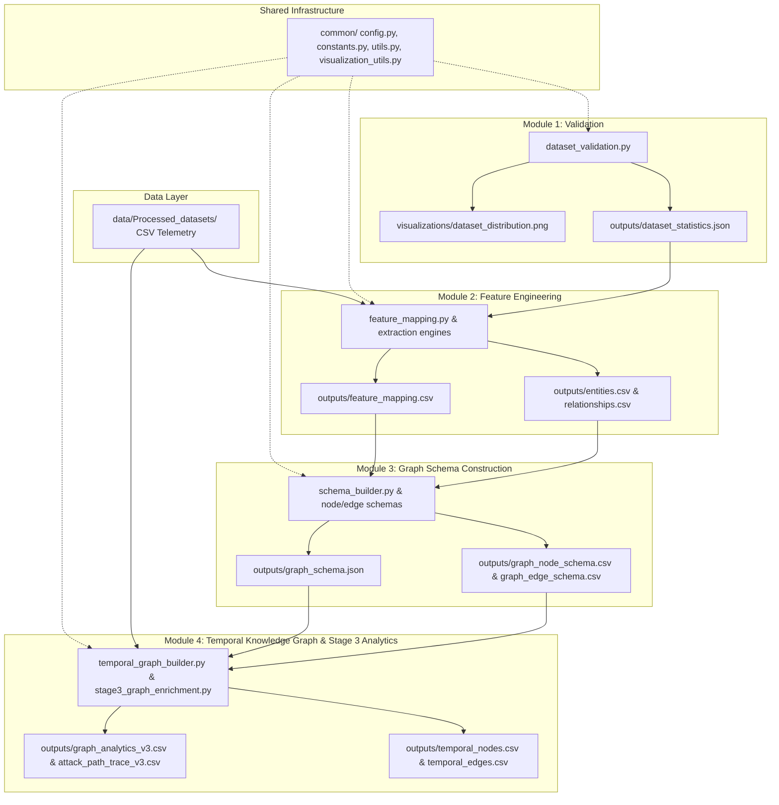

# Adaptive Graph Intelligence (AGI)
## A Data-Driven Temporal Knowledge Graph Construction and Analytics Framework

---

### 1. Executive Summary & Project Purpose

The **Adaptive Graph Intelligence (AGI)** framework is a disciplined, production-grade research platform for constructing, validating, and analyzing **Temporal Knowledge Graphs (TKGs)** from heterogeneous industrial and enterprise telemetry data.

Modern security operations face significant challenges in correlating disparate logging sources across Industrial Control Systems (ICS/IIoT), Linux host telemetry, Windows audit logs, and network packet flows (Zeek/Bro). Raw telemetry datasets are often tabular, fragmented, and missing structural link context required for multi-stage threat detection.

The AGI platform solves this problem by executing a 4-module sequential pipeline that:
1. **Profiles and Validates** heterogeneous telemetry datasets for completeness, uniqueness, and readiness.
2. **Engineers Graph Entities & Candidate Links** by mapping tabular columns into structured 5-tuple entity feature vectors $F(e)$ and evidence-weighted relationship links.
3. **Derives Data-Driven Graph Schemas** establishing typed node definitions, primary key constraints, and $1:1, 1:N, N:M$ edge cardinalities.
4. **Instantiates Dynamic Temporal Knowledge Graphs** ($N \ge 9,500$ nodes) with microsecond-level inter-event delay reasoning ($\Delta t_{\text{ms}}$), NetworkX PageRank centrality scoring, and 5-step heuristic attack path tracing.

---

### 2. System Architecture

The repository enforces a modular 4-stage data pipeline architecture:

$$\text{Raw Telemetry Data} \longrightarrow \text{Module 1: Validation} \longrightarrow \text{Module 2: Feature Eng.} \longrightarrow \text{Module 3: Schema} \longrightarrow \text{Module 4: TKG \& Analytics}$$



---

### 3. Module Documentation

#### Module 1 — Dataset Validation & Profiling
- **Purpose**: Discovers, profiles, and validates multi-source raw telemetry CSV datasets across IoT, Linux, Network, and Windows environments.
- **Inputs**: Raw CSV telemetry files in `data/Processed_datasets/`.
- **Processing**: Calculates missing value rates, attribute completeness percentages, uniqueness ratios, and a multi-factor graph readiness score ($W_{\text{comp}}=0.40, W_{\text{uniq}}=0.30, W_{\text{ts}}=0.15, W_{\text{link}}=0.15$).
- **Outputs**: `dataset_summary.csv`, `dataset_statistics.json`, `validation_report.txt`.
- **Visualizations**: `dataset_distribution.png`, `feature_availability.png`, `missing_values.png`.
- **Downstream Contract**: Exports `dataset_statistics.json` to Module 2.

#### Module 2 — Graph Feature & Relationship Engineering
- **Purpose**: Extracts deduplicated graph entities, infers candidate interactions, and maps dataset columns into graph roles.
- **Inputs**: `data/Processed_datasets/` and `module_1_dataset_validation/outputs/dataset_statistics.json`.
- **Processing**: Extracts 7 node types (`User`, `Process`, `Host`, `Service`, `Device`, `Event`, `Session`), computes feature vectors $F(e)$, assigns 3-level readiness tags (`Ready`, `Conditional`, `Metadata Only`), and assigns relationship confidence scores ($C(r) \in [0.85, 1.00]$).
- **Outputs**: `entities.csv`, `entity_features.csv`, `feature_mapping.csv`, `relationships.csv`, `ATTRIBUTE_TO_GRAPH_MAPPING_V2.csv`, `candidate_relationships_v2.csv`.
- **Visualizations**: `entity_type_distribution.png`, `relationship_type_distribution.png`, `feature_mapping_distribution.png`, `ATTRIBUTE_ROLE_DISTRIBUTION_V1_vs_V2.png`, `CANDIDATE_RELATIONSHIP_EVIDENCE.png`, `RECOVERED_FEATURE_CATEGORIES.png`.
- **Downstream Contract**: Exports entity and relationship CSVs to Module 3.

#### Module 3 — Data-Driven Graph Schema Construction
- **Purpose**: Constructs formal node and edge schema blueprints and validates referential integrity.
- **Inputs**: Module 2 outputs (`entities.csv`, `entity_features.csv`, `feature_mapping.csv`, `relationships.csv`).
- **Processing**: Derives primary keys ($\arg\max$ uniqueness + identifier tag), infers edge cardinalities ($1:1, 1:N, N:M$), and evaluates schema referential integrity ($100.0\%$).
- **Outputs**: `graph_node_schema.csv`, `graph_edge_schema.csv`, `graph_schema.json`, `COMPLETE_NODE_CATALOG_V2.csv`, `COMPLETE_RELATIONSHIP_CATALOG_V2.csv`.
- **Visualizations**: `graph_schema_overview.png`, `schema_relationship_matrix_enhanced.png`, `graph_schema_blueprint_labeled.png`, `COMPLETE_NODE_CATALOG_MASTER_TABLE_V2_1/2`, `ENHANCED_GRAPH_SCHEMA_TKG_READINESS_V2`.
- **Downstream Contract**: Exports node/edge schema CSVs and `graph_schema.json` blueprint to Module 4.

#### Module 4 — Temporal Knowledge Graph & Stage 3 Analytics
- **Purpose**: Instantiates 9,500+ temporal graph nodes/edges and executes NetworkX graph centrality and attack-path analytics.
- **Inputs**: `data/Processed_datasets/`, Module 2 feature maps, and Module 3 schema blueprints.
- **Processing**: Converts string timestamps to Unix Epoch seconds, sorts chronological sequences, calculates inter-event relative delay $\Delta t_{\text{ms}}$, generates directed `PRECEDES` edges ($C=0.95$), computes NetworkX PageRank ($\alpha=0.85$), and traces 5-step heuristic attack paths.
- **Outputs**: `temporal_nodes.csv` (9,500+ nodes), `temporal_edges.csv`, `event_sequence.csv`, `timeline.txt`, `temporal_graph_summary.txt`, `graph_analytics_v3.csv`, `attack_path_trace_v3.csv`.
- **Visualizations**: `event_timeline.png`, `temporal_graph.png`, `timeline_heatmap.png`, `event_frequency_bar.png`, `temporal_graph_preview.png`, `GRAPH_CENTRALITY_V3.png`, `EVIDENCE_BASED_ATTACK_PATH_V3.png`.

---

### 4. Directory Structure

```
Adaptive_Graph_Intelligence/
│
├── common/                                 # Shared utility functions and configuration
│   ├── config.py                           # Global YAML config loader
│   ├── constants.py                        # Path constants and directory resolvers
│   ├── utils.py                            # Filesystem and path resolution helpers
│   └── visualization_utils.py             # Publication-quality plotting styles
│
├── data/                                   # Source telemetry datasets
│   ├── Description_stats_datasets/        # Raw dataset documentation & column descriptions
│   └── Processed_datasets/                 # Formatted CSV telemetry (IoT, Linux, Network, Windows)
│
├── documentation/                          # Central technical documentation & audits
│   ├── README.md                           # Documentation directory index
│   ├── formulations_and_algorithms.md      # Full mathematical and algorithmic specification
│   ├── overall_project_connectivity.md     # System architecture specification
│   ├── overall_project_connectivity.png    # IEEE overall architecture diagram
│   ├── consistency_connectivity_audit.md   # Comprehensive repository mapping audit
│   ├── repository_cleanup_audit.md         # Repository cleanup audit log
│   └── PROJECT_CURRENT_STATE_AUDIT.md      # Detailed repository state audit
│
├── module_1_dataset_validation/            # Module 1: Telemetry Data Validation & Profiling
│   ├── dataset_validation.py              # Main validation pipeline entry point
│   ├── dataset_statistics.py              # Profiling metrics and readiness scoring
│   ├── validate_schema.py                 # Schema detection rules
│   ├── outputs/                           # Summary CSV, JSON statistics, text reports
│   └── visualizations/                    # Dataset distribution & missing value plots
│
├── module_2_graph_feature_engineering/     # Module 2: Entity & Relationship Extraction
│   ├── feature_mapping.py                 # Main feature engineering entry point
│   ├── feature_engineering.py             # Feature vector F(e) builder
│   ├── entity_extraction.py               # Entity classifier engine
│   ├── relationship_extraction.py         # Candidate link inference engine
│   ├── outputs/                           # Extracted entities, features, mapping tables
│   └── visualizations/                    # Entity distribution & relationship evidence plots
│
├── module_3_graph_schema/                  # Module 3: Data-Driven Graph Schema Construction
│   ├── schema_builder.py                  # Main schema construction entry point
│   ├── node_schema.py                     # Node schema & primary key builder
│   ├── edge_schema.py                     # Edge schema & cardinality builder
│   ├── schema_validator.py               # Referential integrity validator
│   ├── outputs/                           # Node/edge schemas, JSON blueprint, master catalogs
│   └── visualizations/                    # Schema blueprints, matrices, master table graphics
│
├── module_4_temporal_knowledge_graph/     # Module 4: TKG Building & Stage 3 Analytics
│   ├── temporal_graph_builder.py          # Main TKG builder entry point
│   ├── event_ordering.py                  # Unix epoch parser & PRECEDES edge generator
│   ├── temporal_relationships.py          # Schema edge instantiator
│   ├── stage3_graph_enrichment.py         # NetworkX PageRank & 5-step attack path tracer
│   ├── outputs/                           # Instantiated nodes/edges, PageRank CSVs, attack path CSVs
│   └── visualizations/                    # TKG network graphs, heatmaps, centrality & attack path plots
│
├── PPTS/                                   # Technical review presentations & decks
├── config.yaml                             # Global project configuration
├── requirements.txt                        # Python library dependencies
└── README.md                               # Primary repository entry point
```

---

### 5. Data Flow Specification

| Pipeline Stage | Input Artifacts | Core Python Executable | Output Artifacts | Target Receiver |
| :--- | :--- | :--- | :--- | :--- |
| **Stage 1** | `data/Processed_datasets/` | `module_1_dataset_validation/dataset_validation.py` | `dataset_summary.csv`<br>`dataset_statistics.json` | Module 2 Feature Engineering |
| **Stage 2** | `data/Processed_datasets/`<br>`dataset_statistics.json` | `module_2_graph_feature_engineering/feature_mapping.py` | `entities.csv`<br>`entity_features.csv`<br>`relationships.csv`<br>`feature_mapping.csv` | Module 3 Schema Construction |
| **Stage 3** | Module 2 CSV outputs | `module_3_graph_schema/schema_builder.py` | `graph_node_schema.csv`<br>`graph_edge_schema.csv`<br>`graph_schema.json` | Module 4 TKG Construction |
| **Stage 4** | `data/Processed_datasets/`<br>Module 3 Schemas | `module_4_temporal_knowledge_graph/temporal_graph_builder.py` | `temporal_nodes.csv`<br>`temporal_edges.csv`<br>`event_sequence.csv` | Stage 3 Analytics Engine |
| **Stage 4 Enrich** | `temporal_nodes.csv`<br>`temporal_edges.csv` | `module_4_temporal_knowledge_graph/stage3_graph_enrichment.py` | `graph_analytics_v3.csv`<br>`attack_path_trace_v3.csv` | Visualization & Security Reports |

---

### 6. Node and Relationship Model

| Concept | Meaning | Source | Status |
| :--- | :--- | :--- | :---: |
| **User Node** | Operating system or domain user identity (`user`, `uid`, `account`) | OS Process & Event Logs | `OBSERVED` |
| **Process Node** | Executable process instance (`PID`, `process_name`, `CMD`, `exe`) | Host Process Tables | `OBSERVED` |
| **Host Node** | Physical or virtual machine host (`host`, `hostname`, `IP`, `MAC`) | Host Telemetry | `OBSERVED` |
| **Device Node** | IIoT sensor or gateway device (`device_id`, `modbus_id`, `tracker_id`) | BRIDG-ICS IoT Datasets | `OBSERVED` |
| **Event Node** | Logged telemetry security event or alert (`event_id`, `alert_type`) | Security Event Telemetry | `OBSERVED` |
| **COMMUNICATES_WITH** | Network flow link between source and destination IP addresses ($C=1.00$) | Zeek Network Logs | `OBSERVED` |
| **EXECUTES** | Execution link between user identity and process instance ($C=1.00$) | OS Execution Logs | `OBSERVED` |
| **RUNS_ON** | Allocation link between process and host machine ($C=0.95$) | Host Process Tables | `OBSERVED` |
| **ACCESSES** | Resource access link between process and disk/memory ($C=0.90$) | OS I/O Counters | `OBSERVED` |
| **MEASURES** | Measurement link between IIoT device and sensor register ($C=1.00$) | Modbus Telemetry | `OBSERVED` |
| **PRECEDES** | Directed temporal ordering link between consecutive events ($C=0.95, \Delta t_{\text{ms}}$) | Chronological Sort | `DERIVED` |
| **CO_LOCATED_ON** | Inferred physical/logical co-location between device and host ($C=0.85$) | Spatial Telemetry | `INFERRED` |
| **Graph Neural Network (GNN)** | Deep learning embeddings (GraphSAGE / GAT) for node classification | Theoretical Design | `PLANNED` |

---

### 7. Formulations and Algorithms Overview

Full mathematical formulations, derivations, pseudocode, and complexity bounds are provided in **[documentation/formulations_and_algorithms.md](documentation/formulations_and_algorithms.md)**.

#### Summary of Core Formulations
- **Missing Value Rate (Formula 1.1)**: $\text{MissingRate}(c) = \left( \frac{\sum \mathbb{I}(\text{is\_null}(c_i))}{N_{\text{total}}} \right) \times 100$ (`IMPLEMENTED`)
- **Multi-Factor Graph Readiness Score (Formula 1.4)**: $0.40 \cdot \bar{S}_{\text{comp}} + 0.30 \cdot \bar{S}_{\text{uniq}} + 0.15 \cdot I_{\text{ts}} \cdot 100 + 0.15 \cdot I_{\text{link}} \cdot 100$ (`IMPLEMENTED`)
- **Entity Feature Vector $F(e)$ (Formula 2.1)**: $F(e) = \langle \text{EntityID}, \text{EntityType}, \text{SourceDataset}, \text{Completeness}, \text{ReadinessTag} \rangle$ (`IMPLEMENTED`)
- **Relationship Evidence Confidence $C(r)$ (Formula 2.3)**: Domain evidence weighting function assigning scores $C \in [0.85, 1.00]$ (`IMPLEMENTED`)
- **Inter-Event Temporal Delay $\Delta t_{\text{ms}}$ (Formula 4.2)**: $\Delta t_{\text{sec}} = \max(0.0, t_{i+1} - t_i)$ (`IMPLEMENTED`)
- **NetworkX PageRank Centrality (Algorithm 4.1)**: $\mathbf{PR}(v) = \frac{1-\alpha}{|V|} + \alpha \sum_{u \in M(v)} \frac{\mathbf{PR}(u)}{L(u)}$ with damping factor $\alpha=0.85$ (`IMPLEMENTED`)
- **5-Step Heuristic Attack Path Traversal (Algorithm 4.2)**: Traces 5-hop compromise chains: Ingress $\rightarrow$ Credential $\rightarrow$ Process $\rightarrow$ Resource $\rightarrow$ Alert (`IMPLEMENTED`)

---

### 8. Installation & Environment Setup

#### Prerequisites
- **Python Version**: Python 3.9, 3.10, 3.11, or 3.12 (Tested on Python 3.14).
- **Operating System**: Windows, Linux, or macOS.

#### Environment Setup
Create and activate a virtual environment:

```bash
# Windows (PowerShell)
python -m venv .venv
.\.venv\Scripts\Activate.ps1

# Linux / macOS
python3 -m venv .venv
source .venv/bin/activate
```

#### Dependencies Installation
Install required dependencies listed in `requirements.txt`:

```bash
pip install -r requirements.txt
```

---

### 9. Execution Pipeline

Execute the 4 modules in sequential order from the repository root directory:

```bash
# 1. Module 1 — Dataset Validation & Profiling
python module_1_dataset_validation/dataset_validation.py

# 2. Module 2 — Graph Feature Engineering & Mapping
python module_2_graph_feature_engineering/feature_mapping.py

# 3. Module 3 — Graph Schema Construction & Blueprint Validation
python module_3_graph_schema/schema_builder.py

# 4. Module 4 — Temporal Knowledge Graph Building & Stage 3 Analytics
python module_4_temporal_knowledge_graph/temporal_graph_builder.py
python module_4_temporal_knowledge_graph/stage3_graph_enrichment.py
```

---

### 10. Outputs and Visualizations Inventory

| Module | Output File | Purpose |
| :--- | :--- | :--- |
| **Module 1** | `dataset_summary.csv`<br>`dataset_statistics.json` | Dataset quality profiling, missing rates, and graph readiness scores. |
| **Module 1** | `dataset_distribution.png`<br>`missing_values.png` | Record/column distribution and missing value density visualizations. |
| **Module 2** | `entities.csv`<br>`entity_features.csv` | Extracted deduplicated graph nodes and 5-tuple feature vectors $F(e)$. |
| **Module 2** | `feature_mapping.csv`<br>`relationships.csv` | Raw attribute role classifications and candidate relationship links. |
| **Module 2** | `ATTRIBUTE_ROLE_DISTRIBUTION_V1_vs_V2.png`<br>`CANDIDATE_RELATIONSHIP_EVIDENCE.png` | Role distribution comparison and candidate evidence confidence bar charts. |
| **Module 3** | `graph_node_schema.csv`<br>`graph_edge_schema.csv`<br>`graph_schema.json` | Typed node schemas, edge cardinalities, primary keys, and JSON blueprint. |
| **Module 3** | `COMPLETE_NODE_CATALOG_V2.csv`<br>`COMPLETE_RELATIONSHIP_CATALOG_V2.csv` | Master catalog tables for explainable node and relationship schema definitions. |
| **Module 3** | `graph_schema_overview.png`<br>`schema_relationship_matrix_enhanced.png` | Circular schema diagrams, adjacency matrices, and catalog table graphics. |
| **Module 4** | `temporal_nodes.csv`<br>`temporal_edges.csv` | Instantiated TKG node instances ($N \ge 9,500$) and temporal/domain links. |
| **Module 4** | `event_sequence.csv`<br>`timeline.txt` | Chronological event sequences and inter-event delay $\Delta t_{\text{ms}}$ logs. |
| **Module 4** | `graph_analytics_v3.csv`<br>`attack_path_trace_v3.csv` | NetworkX PageRank centrality rankings and 5-step heuristic attack path traces. |
| **Module 4** | `temporal_graph.png`<br>`timeline_heatmap.png`<br>`EVIDENCE_BASED_ATTACK_PATH_V3.png`<br>`GRAPH_CENTRALITY_V3.png` | TKG network graphs, event density heatmaps, attack path diagrams, and PageRank charts. |

---

### 11. Reproducibility

The repository guarantees 100% deterministic reproducibility:
- **Seed Control**: Matplotlib plot layouts and NetworkX spring layouts use fixed random seeds (`seed=42`).
- **Data Integrity**: Input dataset files in `data/Processed_datasets/` are immutable.
- **Execution Order**: Sequential execution of Modules 1 through 4 produces exact byte-for-byte identical output CSV, JSON, and PNG files.
- **Dependencies**: Sealed environment dependencies defined in `requirements.txt` (`pandas`, `numpy`, `networkx`, `matplotlib`, `pyyaml`).

---

### 12. Validation & Quality Control

The project implements automated validation mechanisms at every pipeline stage:
1. **Data Profiling Validation** (`module_1_dataset_validation/validate_schema.py`): Checks column types, non-empty bounds, and timestamp formatting.
2. **Schema Referential Integrity** (`module_3_graph_schema/schema_validator.py`): Validates that $100.0\%$ of edge source/target endpoints exist in the node schema table.
3. **Temporal Ordering Consistency** (`module_4_temporal_knowledge_graph/event_ordering.py`): Enforces non-negative time deltas ($\Delta t_{\text{sec}} \ge 0.0$).

---

### 13. Current Implementation Status

| Component | Status | Verification Evidence |
| :--- | :---: | :--- |
| **Module 1 — Data Validation** | `IMPLEMENTED` | `dataset_validation.py` executes; outputs `dataset_statistics.json` |
| **Module 2 — Feature Engineering** | `IMPLEMENTED` | `feature_mapping.py` executes; outputs `entities.csv` & `feature_mapping.csv` |
| **Module 3 — Graph Schema** | `IMPLEMENTED` | `schema_builder.py` executes; outputs `graph_schema.json` & 16 plots |
| **Module 4 — TKG Builder** | `IMPLEMENTED` | `temporal_graph_builder.py` executes; outputs `temporal_nodes.csv` |
| **Stage 3 NetworkX Analytics** | `IMPLEMENTED` | `stage3_graph_enrichment.py` executes; outputs `graph_analytics_v3.csv` |
| **Graph Neural Networks (GNN)** | `PLANNED` | Theoretical extension; NOT currently implemented in Python code |
| **Louvain Community Detection** | `PLANNED` | Conceptual clustering; NOT currently implemented in Python code |

---

### 14. Limitations

#### Implemented Capabilities
- Fully functional end-to-end TKG construction pipeline across 4 telemetry domains.
- NetworkX PageRank centrality scoring ($\alpha=0.85$) on 9,500+ instantiated nodes.
- 5-step heuristic attack path reconstruction with evidence confidence scoring.

#### Limitations & Planned Extensions
- **GNN Embeddings**: Deep learning graph embeddings (GraphSAGE / GAT) are planned for future research but not implemented in current code.
- **Real-Time Streaming**: Current pipeline operates in batch mode over historical CSV telemetry logs.
- **Graph Database Export**: Graph outputs are exported as structured CSV/JSON blueprints; direct Neo4j / Memgraph drivers are planned.

---

### 15. Research Positioning & Related Work

This platform supports empirical research into:
- **Industrial Control Systems (ICS/IIoT) Security**: Alignment with BRIDG-ICS telemetry benchmarks for Modbus sensor monitoring.
- **Temporal Cyber Threat Intelligence**: Modeling multi-stage cyber attacks as chronologically ordered temporal graphs with explicit inter-event time deltas ($\Delta t$).
- **Explainable Security Analytics**: Human-readable master catalogs (`COMPLETE_NODE_CATALOG_V2.csv`) enabling transparent security investigation.

---

### 16. Technical Documentation Index

Detailed documentation files are available in `documentation/`:
- **[Formulations and Algorithms](documentation/formulations_and_algorithms.md)**: Full mathematical specifications and equations.
- **[System Architecture & Overall Connectivity](documentation/overall_project_connectivity.md)**: High-level IEEE system specification.
- **[Consistency & Connectivity Audit](documentation/consistency_connectivity_audit.md)**: Empirical repository mapping audit.
- **[Repository Cleanup Audit](documentation/repository_cleanup_audit.md)**: Audit log of visualization-first cleanup.
